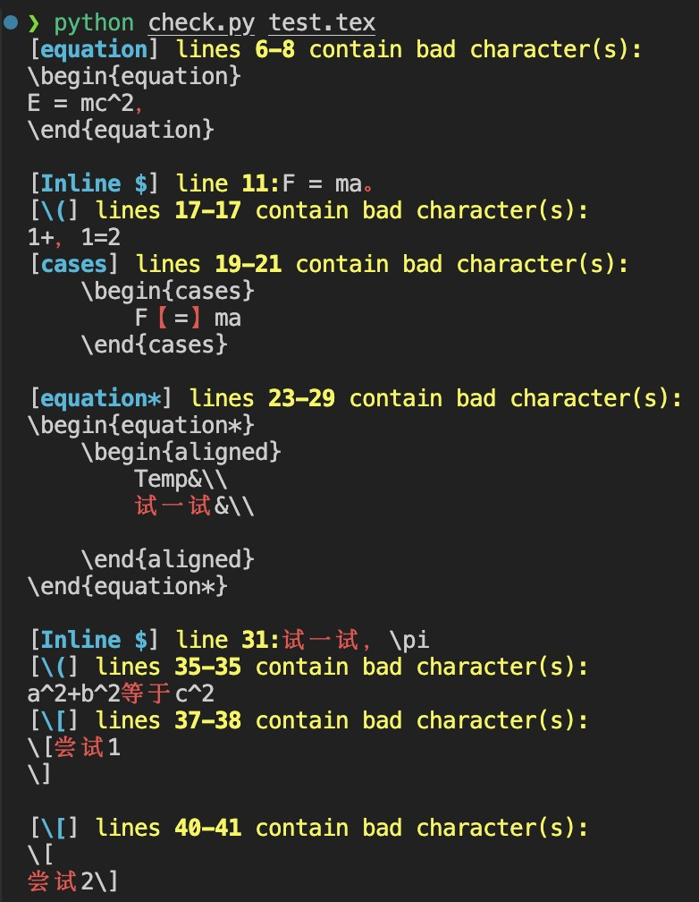

# TeX-Math-Zh-Checker

一个用于 **检测 LaTeX 数学环境中中文字符** 的小工具。（在找中文标点时破防，所以创造了这个小工具，分享给有TeX协作开发需求的同僚们）

---

## ✨ Motivation

> “你是否曾因一个诡异的数学环境报错而翻遍全文？
> 是否曾看到编译器提示：
> ```
> Missing character: There is no ， (U+FF0C) in font [lmroman10-regular]:mapping=tex-text;!
> ```
> 却不知道是哪里的中文字符在作祟？”

LaTeX 中的数学环境（如 `equation`, `align`, `$...$`, `\[...\]` 等）对中文字符极其敏感。一旦误入一个全角逗号、中文句号、或者 `\text{中文}` 中漏掉 `\text`，就会引发难以定位的报错。

虽然许多编辑器能高亮中文字符，但它们不会告诉你 *在哪些数学环境中* 出现了这些非法字符。这个工具正是为此而生：

* 精确定位含中文或全角字符的 **数学环境**
* 支持 **block 环境**（如 `\begin{align}`）与 **inline 数学表达式**
* 可选：检查 `\text{}` 内部内容

---

## 安装与运行

### 1. 克隆或下载本仓库

```bash
git clone https://github.com/yourusername/tex-math-zh-checker.git
cd tex-math-zh-checker
```

### 2. 使用方式

```bash
python3 check_math_chars.py yourfile.tex
```

### 可选参数

* `-t` / `--check-text`
  检查 `\text{}` 中的中文字符（默认跳过）

---

## 示例

```bash
python check.py test.tex
```

得到输出：


